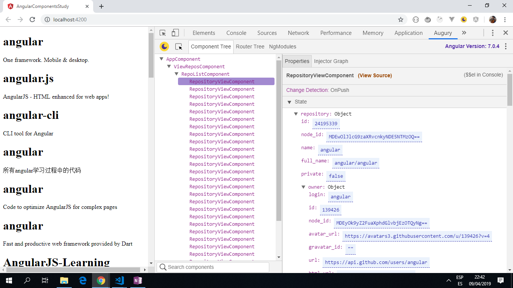

# :zap: Angular Tutorial App

* App to study differences between dumb (presentational and portable) components and smart components (that can have logic, trigger change detection and manage data/services).
* Tutorial code from [Demos With Angular](https://www.youtube.com/channel/UCYFd7Qy93YP7gPERnxP545A) but with updates due to updated Angular versions - see [:clap: Inspiration](#clap-inspiration) below

*** Note: to open web links in a new window use: _ctrl+click on link_**

## :page_facing_up: Table of contents

* [:zap: Angular Tutorial App](#zap-angular-tutorial-app)
  * [:page_facing_up: Table of contents](#page_facing_up-table-of-contents)
  * [:books: General info](#books-general-info)
  * [:camera: Screenshots](#camera-screenshots)
  * [:signal_strength: Technologies](#signal_strength-technologies)
  * [:floppy_disk: Setup](#floppy_disk-setup)
  * [:computer: Code Examples](#computer-code-examples)
  * [:cool: Features](#cool-features)
  * [:clipboard: Status & To-Do List](#clipboard-status--to-do-list)
  * [:clap: Inspiration](#clap-inspiration)
  * [:envelope: Contact](#envelope-contact)

## :books: General info

* This app uses the following Angular concepts: components, data & property binding etc.

## :camera: Screenshots

.

## :signal_strength: Technologies

* [Angular v11](https://angular.io/)
* [Angular CLI v11](https://cli.angular.io/)
* [RxJS Library v6](https://angular.io/guide/rx-library) used to handle datastreams and propagation of change using observables.
* [Angular Augury Chrome Extension](https://chrome.google.com/webstore/detail/augury/elgalmkoelokbchhkhacckoklkejnhcd) v1.23.0 used for debugging.
* [Angular ChangeDetectionStrategy](https://angular.io/api/core/ChangeDetectionStrategy).

## :floppy_disk: Setup

* Run `ng serve` for a dev server. Navigate to `http://localhost:4200/`. The app will automatically reload if you change any of the source files.

## :computer: Code Examples

* _view-repos component that gets API repo data from github_

```typescript
import { Component, OnInit } from '@angular/core';
import { Observable } from 'rxjs';
import { HttpClient } from '@angular/common/http'
import { map } from 'rxjs/operators';

@Component({
  selector: 'app-view-repos',
  templateUrl: './view-repos.component.html',
  styleUrls: ['./view-repos.component.css']
})

//smart component - loads API data from the internet,
//the data from this ViewReposComponent is consumed by the 'app-repo-list'
//in the app-repository-view component.
export class ViewReposComponent implements OnInit {
  list: Observable<any[]>

  constructor(http: HttpClient) {
    const path = 'https://api.github.com/search/repositories?q=angular';
    this.list = http.get<{items: any[]}>(path)
      .pipe(
        map(data => data.items),
      );
  }

  ngOnInit() {
  }
}

```

## :cool: Features

* Demonstrates difference between smart and dumb components by whether they can trigger change detection/manage data & services

## :clipboard: Status & To-Do List

* Status: Working
* To-Do: nothing

## :clap: Inspiration

* [Youtube video by 'Demos with Angular': The Difference Between Smart and Dumb Components](https://www.youtube.com/watch?v=r9vhfsnOb9o)

## :envelope: Contact

* Created by [ABateman](https://www.andrewbateman.org) - feel free to contact me!
